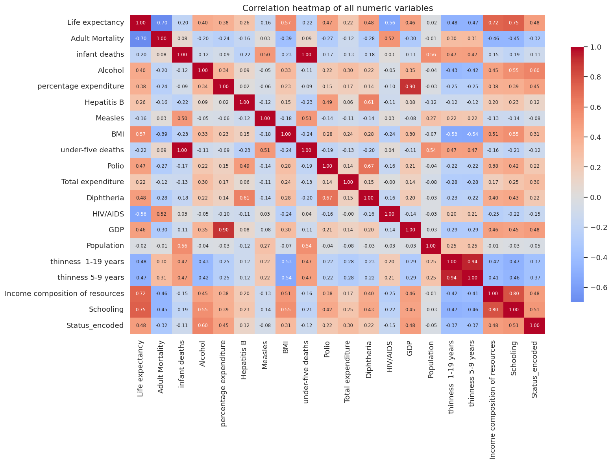
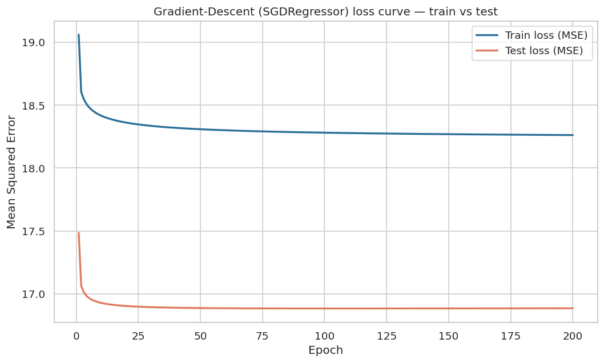
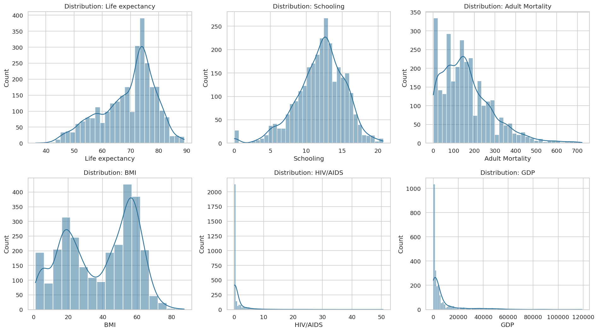
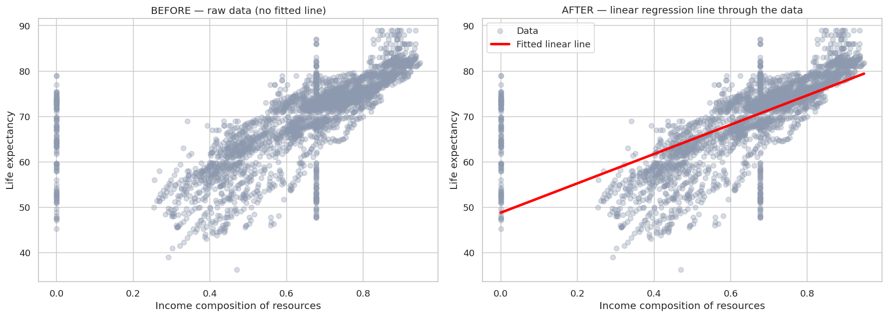

# Life Expectancy Prediction — Linear Regression Model Deployment

## Mission
> To live each day with creativity, curiosity, and responsibility, inspiring innovation through technology and using my engineering skills to improve healthcare outcomes in Africa through digital solutions.

## Problem
This project predicts a **country's average life expectancy (in years)** — the single most-used summary of population health, from its health-system and socio-economic indicators. By showing which levers (schooling, immunization, adult mortality, HIV/AIDS, nutrition) move the outcome, it becomes a decision-support tool for allocating scarce health resources across Africa.

## Dataset — description & source
**Life Expectancy (WHO)** — data compiled by the World Health Organization and the United Nations:
**193 countries, 2000–2015, 2,938 rows × 22 columns** (a mix of health, immunization, mortality and
economic indicators). It is rich in both **volume** (~2.9k rows) and **variety** (20+ predictors).
**Source:** Kaggle — *Life Expectancy (WHO)* by Kumar Rajarshi:
https://www.kaggle.com/datasets/kumarajarshi/life-expectancy-who

## Visualizations (see the notebook for full interpretation)
| Correlation heatmap | Gradient-descent loss curve |
|---|---|
|  |  |

| Feature distributions | Best-fit line (before → after) |
|---|---|
|  |  |

## Models & result
We compared four scikit-learn regressors on the same 8 engineered features (test set, 20% hold-out):

| Model | RMSE (years) | R² |
|---|---|---|
| **Random Forest (SAVED / deployed)** | **1.84** | **0.96** |
| Decision Tree | 2.60 | 0.92 |
| SGD — gradient descent (Linear) | 4.12 | 0.80 |
| OLS Linear Regression | 4.12 | 0.80 |

The model with the **least loss** (Random Forest) is saved as
`summative/API/best_model.pkl` and served by the API.

---

## Public API endpoint (Swagger UI)

**Swagger UI:** `https://linear-regression-model-z9ly.onrender.com/docs`
**Prediction endpoint:** `POST https://linear-regression-model-z9ly.onrender.com/predict`

## 🎥 Video demo link
> video id

---

## Run the notebook with uv
```bash
cd summative
uv sync                 # creates .venv from uv.lock
uv run jupyter notebook linear_regression/multivariate.ipynb
```

## Run the API locally
```bash
cd summative/API
uv run uvicorn prediction:app --reload      # or: pip install -r requirements.txt && uvicorn prediction:app --reload
# open http://127.0.0.1:8000/docs
```

## Run the mobile app
From the repo root:

cd summative/FlutterApp

Set your deployed API URL at the top of `lib/main.dart`:

const String kApiBaseUrl = "https://linear-regression-model-z9ly.onrender.com";

If the platform folders (android/, ios/) are not present, generate them first:

flutter create .

Then fetch packages and launch on a connected emulator or device:

flutter pub get
flutter run

Enter the 8 indicator values, tap **Predict**, and the predicted life
expectancy (or a validation error) appears below the form.

## API — CORS configuration reasoning
CORS is scoped deliberately (no wildcard): **origins** are limited to the hosted Swagger UI and local
Flutter-web dev origins (a native mobile app sends no `Origin` header, so it is unaffected);
**methods** are limited to `GET`/`POST` (the only ones used); **headers** to `Content-Type`; and
**credentials** are disabled because the API is stateless (no cookies/auth). This blocks arbitrary
third-party websites from calling the API from a user's browser while allowing every legitimate
client. Extra origins can be added via the `ALLOWED_ORIGINS` environment variable on Render.

## Retraining
`POST /retrain` accepts a CSV upload of new rows (8 features + `Life expectancy`). It appends them to
the stored data, retrains the Random Forest, evaluates on a hold-out split, then **hot-swaps** the
live model and `best_model.pkl` — so predictions immediately use the updated model with no redeploy.
